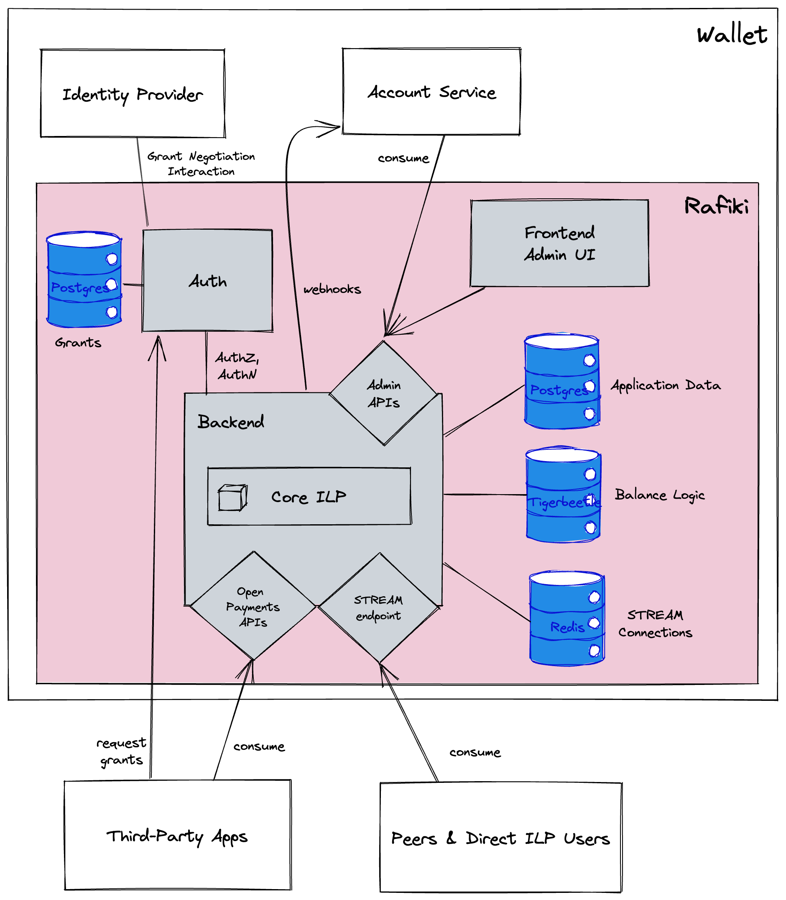

# Components

The Rafiki components are run together in kubernetes, and each one can be horizontally scaled as a replica set.

Rafiki depends on 3 databases. A postgres database is used by the API and Connector (shown as 2 postgres databases in the diagram because they won't write to the same tables). The Tigerbeetle database is used for accounting balances at the ILP layer. Redis is used as a cache to share STREAM connection details across processes.

# Connector

The connector is responsible for handling ILP packets. This functionality includes:

- Accepting ILP packets over an HTTP interface and authenticating them against ILP account credentials
- Routing ILP packets to the correct destination account
- Converting currencies (this will be configurable to optionally fetch rates from the wallet's rate backend)
- Sending out ILP packets over HTTP for destinations that are not local
- Fulfilling packets with an internal STREAM server for destinations that are local (the SPSP server would live in the API backend)

To accomplish this, the connector needs to create and update ILP accounts by talking to the account service. Because balances must be updated on every packet (potentially thousands of times per second), the connector and account service run in the same process to make this communication efficient.

# Account Service

The account service interfaces with postgres and tigerbeetle to manage account settings and balances. The connector and API backend both communicate with the account service internally. The wallet operator also calls the account service to manage user accounts.

Accounts managed by the account service can have sub-accounts created under them. This means that in addition to each wallet user having an account in the account service, there is also an account stored for each invoice and mandate under that account.

The account service exposes these APIs for managing accounts:

- Create a ILP account with balance limits (which creates a row in tigerbeetle and a row in postgres)
- Set prefix, connection details, max packet size, and other ILP-level configuration on an ILP account
- Get the status of an account to determine how much has been received or how close it is to exhausting its sending limits
- Move balance atomically between a number of ILP accounts (i.e. to move money from a user's account into a mandate so an invoice can be paid, or sweep an invoice into a user's primary account).

[Rafiki Connector Account Management API](./account-service-api.md)

# API Backend

The API backend exposes the application-layer APIs used by wallets and other developers. This includes functionality such as:

- Querying a payment pointer with SPSP
- Sending money from an account in a discrete payment
- Authorizing a third party to access funds on an account
- Open Payments APIs

The API backend manages application data in postgres, keeping track of transaction history, metadata around invoices/mandates, and API keys.

# Frontend

The frontend hosts the OAuth consent screens used in the open payments flows. The wallet will need to expose these pages on their own domain and manage authentication. The exact scheme that will be used here still needs to be determined.
